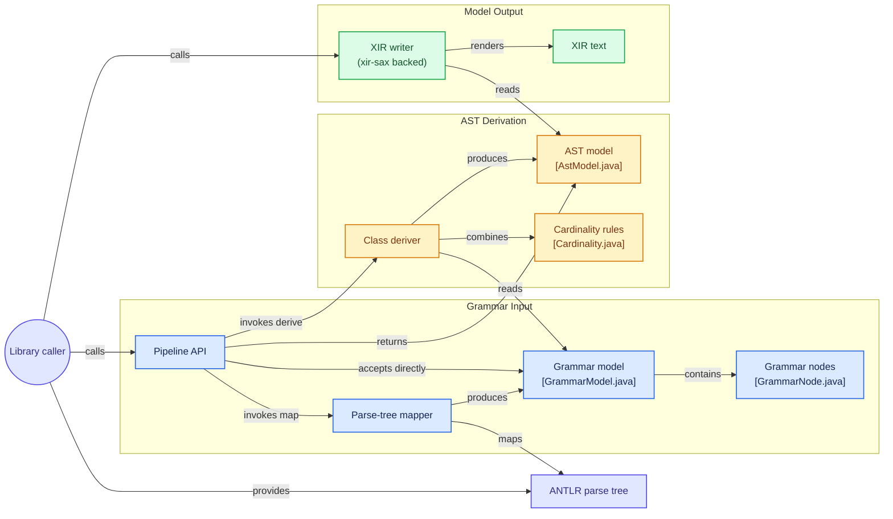

# Architecture Overview xir-g4

```mermaid
flowchart LR

subgraph group_input["Grammar Input"]
  node_pipeline["Pipeline API"]
  node_mapper["Parse-tree mapper"]
  node_grammar_model["Grammar model<br/>[GrammarModel.java]"]
  node_grammar_nodes["Grammar nodes<br/>[GrammarNode.java]"]
end

subgraph group_derive["AST Derivation"]
  node_deriver["Class deriver"]
  node_cardinality["Cardinality rules<br/>[Cardinality.java]"]
  node_ast_model["AST model<br/>[AstModel.java]"]
end

subgraph group_output["Model Output"]
  node_writer["XIR writer<br/>(xir-sax backed)"]
  node_xir["XIR text"]
end

node_user(("Library caller"))
node_parse_tree["ANTLR parse tree"]

node_user -->|"provides"| node_parse_tree
node_user -->|"calls"| node_pipeline
node_pipeline -->|"invokes map"| node_mapper
node_mapper -->|"maps"| node_parse_tree
node_mapper -->|"produces"| node_grammar_model
node_pipeline -->|"accepts directly"| node_grammar_model
node_grammar_model -->|"contains"| node_grammar_nodes
node_deriver -->|"reads"| node_grammar_model
node_deriver -->|"combines"| node_cardinality
node_deriver -->|"produces"| node_ast_model
node_pipeline -->|"returns"| node_ast_model
node_pipeline -->|"invokes derive"| node_deriver
node_user -->|"calls"| node_writer
node_writer -->|"reads"| node_ast_model
node_writer -->|"renders"| node_xir

click node_pipeline "https://github.com/jurgenei/xir-g4/blob/main/src/main/java/name/jurgenei/ast/core/AstClassesPipeline.java"
click node_mapper "https://github.com/jurgenei/xir-g4/blob/main/src/main/java/name/jurgenei/ast/core/mapper/ParseTreeToGrammarModelMapper.java"
click node_grammar_model "https://github.com/jurgenei/xir-g4/blob/main/src/main/java/name/jurgenei/ast/core/model/GrammarModel.java"
click node_grammar_nodes "https://github.com/jurgenei/xir-g4/blob/main/src/main/java/name/jurgenei/ast/core/model/GrammarNode.java"
click node_deriver "https://github.com/jurgenei/xir-g4/blob/main/src/main/java/name/jurgenei/ast/core/AstClassDeriver.java"
click node_cardinality "https://github.com/jurgenei/xir-g4/blob/main/src/main/java/name/jurgenei/ast/core/model/Cardinality.java"
click node_ast_model "https://github.com/jurgenei/xir-g4/blob/main/src/main/java/name/jurgenei/ast/core/model/AstModel.java"
click node_writer "https://github.com/jurgenei/xir-g4/blob/main/src/main/java/name/jurgenei/ast/core/AstXirWriter.java"

classDef toneNeutral fill:#f8fafc,stroke:#334155,stroke-width:1.5px,color:#0f172a
classDef toneBlue fill:#dbeafe,stroke:#2563eb,stroke-width:1.5px,color:#172554
classDef toneAmber fill:#fef3c7,stroke:#d97706,stroke-width:1.5px,color:#78350f
classDef toneMint fill:#dcfce7,stroke:#16a34a,stroke-width:1.5px,color:#14532d
classDef toneRose fill:#ffe4e6,stroke:#e11d48,stroke-width:1.5px,color:#881337
classDef toneIndigo fill:#e0e7ff,stroke:#4f46e5,stroke-width:1.5px,color:#312e81
classDef toneTeal fill:#ccfbf1,stroke:#0f766e,stroke-width:1.5px,color:#134e4a
class node_pipeline,node_mapper,node_grammar_model,node_grammar_nodes toneBlue
class node_deriver,node_cardinality,node_ast_model toneAmber
class node_writer,node_xir toneMint
class node_user,node_parse_tree toneIndigo
```